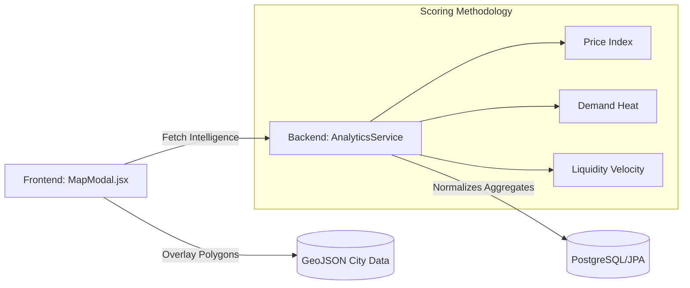

  # 🗺️ Urban Nest Heatmap Engine
  **Advanced Geospatial Market Intelligence & Predictive Visualization**

---

## 🏗️ Technical Architecture
The Urban Nest Heatmap is an enterprise-grade visual analytics engine that translates high-dimensional property data into intuitive geographic clusters. It leverages **GeoJSON** precision layers with a multi-factor **Normalization Pipeline** to deliver real-time sentiment across major Indian metros.

---

## 🎯 Coverage Matrix
| City | Layer | Targeted Detail |
| :--- | :--- | :--- |
| 🏙️ **Ahmedabad** | `ahmedabad.geojson` | Commercial & Residential Hubs |
| 🌊 **Mumbai** | `mumbai.geojson` | High-Value Coastal Districts |
| 🌳 **Bangalore** | `bangalore.geojson` | Tech Corridors & Suburbs |

---

### 📐 Technical Scoring Formulas

#### ⚖️ 1. Price Value Index (Log-Normalized Median)
We apply a logarithmic scale to neutralize the impact of luxury outliers and ensure a smooth distribution across market segments:
$$Score_{price} = \left( \frac{\ln(P_{median}) - \ln(P_{min})}{\ln(P_{max}) - \ln(P_{min})} \right) \times 100$$
*Where $P$ represents the effective Price per SqFt for active listings.*

#### 📦 2. Inventory Volume (Saturation)
Calculated as the relative saturation of active listings against the peak supply zone of the city:
$$Score_{inventory} = \left( \frac{N_{active}}{N_{peak\_zone}} \right) \times 100$$

#### 🔥 3. Market Activity Score (Engagement + Liquidity)
A multi-factor index combining user interest with transaction velocity:
- **Demand Index ($D$):** $\frac{\frac{Views}{Listings} + \frac{Favorites}{Listings}}{2}$
- **Liquidity Index ($L$):** $\frac{100}{1 + \frac{AvgDaysOnMarket}{30}}$
- **Consolidated Activity:** $percentile(D \times 0.5 + L \times 0.5)$

#### 💎 4. Buyer Opportunity Ranking
Identifies undervalued zones with high negotiation leverage based on age of listings and relative supply:
- **Days Component:** $\min\left(\frac{AvgDaysOnMarket}{90}, 1.0\right) \times 40$
- **Inventory Component:** $\min\left(\frac{N_{active}}{N_{avg\_city\_listings}}, 2.0\right) \times 10$
- **Opportunity Score:** $\min(DaysComp + InvComp, 100.0)$

---

## 🎨 Visualization Logic
- **Warmer Spectrum (Red/Orange):** High Value, Intense Demand, Low Liquidity.
- **Cooler Spectrum (Blue/Green):** High Supply, High Liquidity, Value-Buy Zones.
- **Threshold Guard:** Minimum **5 active listings** required for rendering.

---

## 🔌 Analytics Endpoints
| Action | Endpoint | Signature |
| :--- | :--- | :--- |
| **Fetch City Map** | `GET` | `/api/analytics/heatmap/{city}` |
| **Recalculate Cloud** | `POST` | `/api/analytics/compute` |
| **Zone Insights** | `GET` | `/api/properties/stats/{zoneId}` |

---

  *Powering precision real estate decisions in India.*

