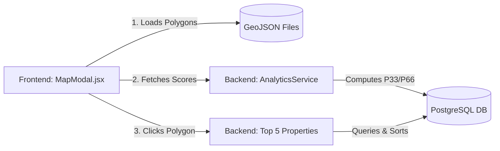

# 🗺️ Urban Nest Heatmap Documentation

Welcome to the **Urban Nest Heatmap** system! The heatmap provides a dynamic, color-coded visual guide to real estate metrics across varying city neighborhoods using interactive GeoJSON polygons.

---

## 🏗️ Architecture

The heatmap relies on a seamless connection between the frontend map rendering and the backend scoring engine.



---

## 🎯 Supported Regions

The system currently supports the following metropolitan areas, each mapped to a specific precision level (zoom).

| City | GeoJSON Source | Default Zoom Level |
| :--- | :--- | :---: |
| 🏙️ **Ahmedabad** | `ahmedabad.geojson` | `12` |
| 🌊 **Mumbai** | `mumbai.geojson` | `11` |
| 🌳 **Bangalore** | `bangalore.geojson` | `11` |

---

## 🎨 Scoring Modes & Color Strategy

The system features **5 distinct modes** to evaluate a neighborhood's real estate health. It uses fixed, static threshold values to ensure consistent color grading across the heatmap, avoiding ambiguous ranges when property prices are clustered.

> **Note:** A pincode must have **>5 active listings** to be eligible for colored (Low/Med/High) scoring. Otherwise, it defaults to a neutral gray tone to prevent skewed data.

### 👤 Buyer Modes (Visible to Everyone)
| Category | Metric | Visual Indicator |
| :--- | :--- | :--- |
| 💰 **Price** | Median price per sqft | Warmer / Redder = More Expensive |
| 📦 **Inventory** | Total available listings | Darker = More Available Options |
| 🏠 **Buyer Opportunity** | Blend of price, inventory & time on market | Higher = Favorable Buyer Conditions |

### 👔 Agent Modes (Restricted Access)
| Category | Metric | Visual Indicator |
| :--- | :--- | :--- |
| 📈 **Demand** | Buyer engagement vs supply | Higher = High Buyer Competition |
| 💧 **Liquidity** | Speed of sale | Higher = Faster Selling Market |

---

## 🧮 Score Computation Algorithms

Scores are calculated whenever properties are added, updated, or sold. They are first computed independently, then normalized against all other pincodes in the same city.

```mermaid
math
```

| Mode | Algorithm / Formula Logic |
| :--- | :--- |
| **Price** | Base: `Median Price/SqFt` in pincode. Then normalized on a logarithmic scale: <br/> `((log(price) - log(min_city_price)) / log_range) * 100` |
| **Inventory** | `(active_listings / max_city_listings) * 100` |
| **Buyer Opportunity** | Weighted index summing normalized **Days on Market** (max 40 points) and local **Inventory Level** relative to the city average (max 20 points). |
| **Demand** | Computes raw engagement (`Views + Favorites + Inquiries` per active listing), then normalizes to a 0-100 scale. |
| **Liquidity** | Measures velocity: `100 / (1 + (avg_days_on_market / 30))` |

---

## 🖱️ Interaction Details

When you click on a colored polygon on the map, the **Mini Property Panel** opens, displaying the **Top 5 Properties** for that specific pincode. The list is intelligently sorted based on the current active mode format.

| Active Map Mode | Sorting Behavior |
| :--- | :--- |
| `price` | **Price (Descending)** — Highlights the most premium properties |
| `buyer_opportunity` | **Price (Ascending)** — Highlights the most affordable options |
| `inventory` or `liquidity` | **Listed Date (Descending)** — Shows the freshest listings |
| `demand` | **Views (Descending)** — Shows the most popular, high-engagement listings |

---

## 🔌 API Reference

For developers, the heatmap interacts with the following backend endpoints:

| Method | Endpoint | Description |
| :---: | :--- | :--- |
| `GET` | `/api/analytics/heatmap/{city}` | Retrieves the rendered scores for the active view. |
| `POST` | `/api/analytics/compute/{city}` | Forces a manual recalculation of the city's scores. |
| `GET` | `/api/properties/top` | Fetches the top 5 properties for a pincode click. |
