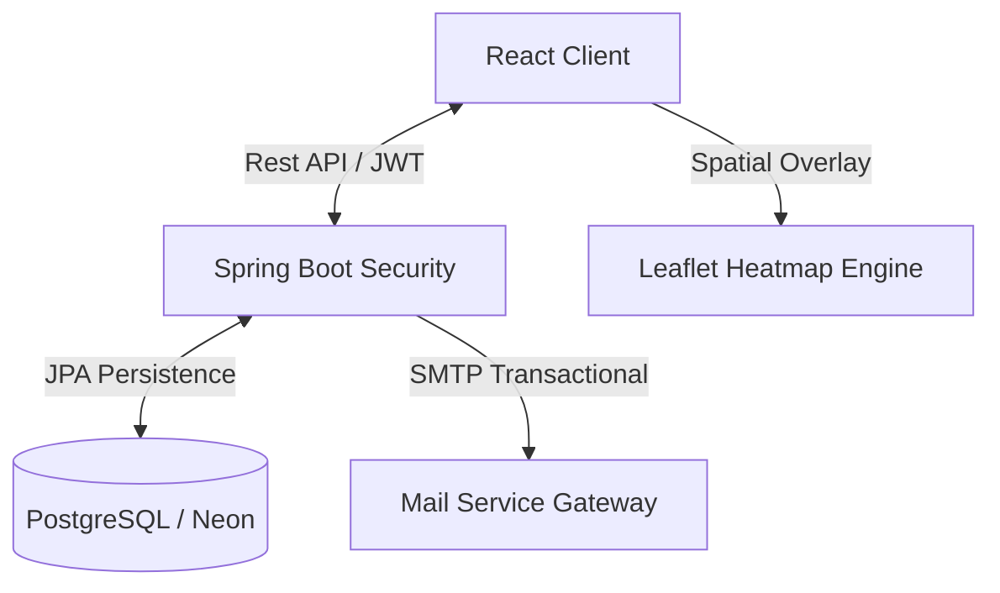

<div align="center">
  # ✨ Urban Nest
  **Premium Full-Stack Real Estate Ecosystem for the Indian Market**

  [**🌐 Live Demo**](https://urban-nest-nine-omega.vercel.app/)

  [](https://www.oracle.com/java/)
  [](https://spring.io/projects/spring-boot)
  [](https://reactjs.org/)
  [](https://vitejs.dev/)
  [](https://neon.tech/)
</div>

---

## 🏙️ Overview
**Urban Nest** is a sophisticated, high-performance real estate platform designed to harmonize property discovery and professional engagement. Built with enterprise-grade Java security and a high-response React frontend, it empowers users with data-driven tools like **Real-Time Market Heatmaps**, **Secure OTP-Verified Flows**, and **Multi-Role Dashboards**.

---

## 🗺️ Project Architecture

Urban Nest follows a decoupled, service-oriented architecture designed for high scalability and clear separation of concerns.

### 🧱 Backend (Spring Boot 3.2.5)
The backend is organized into standard enterprise tiers to ensure maintainability and testability.

- **`controller/`**: Handles incoming REST requests and directs flow to the service layer.
- **`service/`**: Contains core business logic, validation rules, and transaction boundaries.
- **`entity/`**: JPA/Hibernate models mapping directly to your **PostgreSQL** schema.
- **`repository/`**: Abstraction layer for data access using Spring Data JPA.
- **`dto/`**: Specialized Data Transfer Objects for optimized, secure API responses.
- **`security/`**: Comprehensive security stack including JWT generation, authentication filters, and CORS config.
- **`mapper/`**: Automated mapping logic to convert between database entities and API DTOs.
- **`exception/`**: Global error handling using a centralized `@ControllerAdvice`.

### 🎨 Frontend (React + Vite)
The frontend utilizes a component-driven architecture with a focus on performant rendering and modern DX.

- **`pages/`**: Route-level components (e.g., *Dashboard*, *Profile*, *PropertyDetail*) that compose modular child components.
- **`components/`**: Reusable UI atoms and feature-specific molecules:
  - `layout/`: Shared structures like *Navbar*, *Footer*, and *ProfileDrawer*.
  - `property/`: Specialized cards, grids, and filters for real estate listings.
  - `ui/`: Design-system elements like *StatusBadges*, *Skeletons*, and *Modals*.
- **`services/`**: The communication layer interfacing with the Spring Boot API.
- **`context/`**: Global state management (Auth and User state) using React Context API.
- **`utils/`**: Shared logic for currency formatting, date parsing, and visual image processing.

---

## 🛠️ Technical Stack

| Tier | Technologies | Implementation Role |
| :--- | :--- | :--- |
| **Frontend** | React 18, Vite | Performance-First UI & Glassmorphism design |
| **Backend** | Spring Boot 3.2, JPA | Enterprise API Core & Persistence |
| **Security** | Spring Security, JWT | Stateless User Protection & Role-Based Access |
| **Database** | PostgreSQL (Neon Tech) | Relational Integrity & Cloud Scaling |
| **Geospatial** | Leaflet, GeoJSON | Intelligent Market Mapping & Heatmaps |

---

## 🏗️ System Flow



---

## 🚦 Setup & Installation

### 📋 Prerequisites
- **Java 17+**
- **Node.js 18+**
- **Neon PostgreSQL Instance**

### ⚡ Quick Start

1. **Clone the Repository**
   ```bash
   git clone https://github.com/HC-28/urban-nest.git
   cd urban-nest
   ```

2. **Database Configuration**
   - Create a project on [Neon.tech](https://neon.tech).
   - Gather your connection string, username, and password.
   - Configure these in your `backend/src/main/resources/application.properties` or as environment variables in Render.

3. **Backend Launch**
   ```bash
   cd backend
   mvn clean install
   ./mvnw spring-boot:run
   ```

4. **Frontend Launch**
   ```bash
   cd frontend
   npm install
   npm run dev
   ```

---

## 📜 Documentation Reference
- [🗺️ Full Heatmap Methodology](./HEATMAP.md) - Deep dive into spatial scoring and market analytics.
- [🔌 API Specification](./backend/src/main/resources/api-docs.md) - endpoint signatures and DTO schemas.

---

<div align="center">
  **Urban Nest: The Future of Real Estate.** 🏙️
</div>
