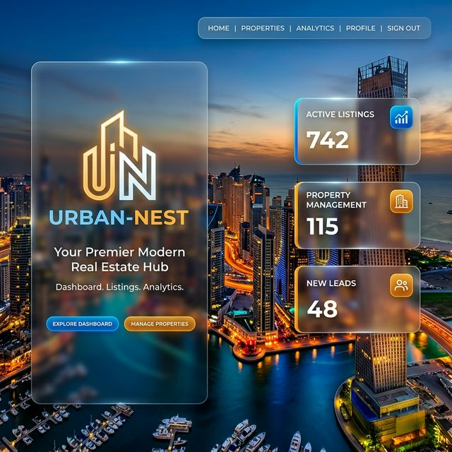
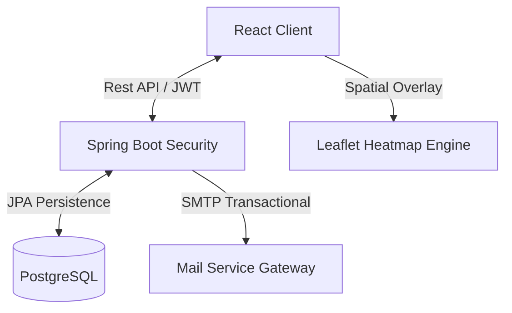

<div align="center">
  

  # ✨ Urban Nest
  **Premium Full-Stack Real Estate Ecosystem for the Indian Market**

  [](https://www.oracle.com/java/)
  [](https://spring.io/projects/spring-boot)
  [](https://reactjs.org/)
  [](https://vitejs.dev/)
</div>

---

## 🏙️ Overview
**Urban Nest** is a sophisticated, high-performance real estate platform designed to harmonize property discovery and professional engagement. Built with enterprise-grade Java security and a high-response React frontend, it empowers users with data-driven tools like **Real-Time Market Heatmaps**, **Secure OTP-Verified Flows**, and **Multi-Role Dashboards**.

---

## 🚀 Enterprise Features

### 🔐 Secure & Verified Auth
- **Double-Factor OTP Mechanism:** State-driven verification for signups and password recovery.
- **Dynamic Role Management:** Intelligent routing for Buyers, Agents, and Platform Administrators.
- **JWT Stateless Security:** Short-lived access tokens with robust backend interceptors.

### 🗺️ Predictive Discovery Engine
- **Geospatial Heatmaps:** Instant visualization of Inventory, Price Trends, and Liquidity (Mumbai, Bangalore, Ahmedabad).
- **Custom Normalization Logic:**
  - $$Score_{price} = \ln(P_{median}) \text{ Model}$$
  - $$Score_{demand} = percentile(Views, Favs, Inquiries)$$
- **Granular Search Stack:** Multi-dimensional filtering across status, budget, and amenities.

### 👔 Elite Agent Workspace
- **Engagement Funnels:** Deep analytics on property performance and user interest.
- **Approval Lifecycle:** Formal documentation and identity verification for agent onboarding.
- **Direct Messaging:** Seamless built-in communication bridge.

---

## 🛠️ Technical Stack

| Tier | Technologies | Role |
| :--- | :--- | :--- |
| **Frontend** | React 18, Vite, Vanilla CSS | Performance-First UI & Glassmorphism design |
| **Backend** | Spring Boot 3.2.5, JPA, Hibernate | Enterprise API Core |
| **Security** | Spring Security, JWT, OTP | Multi-layered user protection |
| **Geospatial** | Leaflet, GeoJSON | Intelligent market mapping |
| **Database** | PostgreSQL | Relational data integrity |

---

## 🏗️ System Architecture



---

## 🚦 Getting Started

### 📋 Prerequisites
- **Java 17+** | **Node.js 18+** | **PostgreSQL 14+**

### ⚡ Quick Launch

1. **Environment Setup**
    ```bash
    git clone https://github.com/HC-28/urban-nest.git
    cd urban-nest
    ```

2. **Backend Gateway**
    ```bash
    cd backend
    ./mvnw spring-boot:run
    ```

3. **Frontend Experience**
    ```bash
    cd frontend
    npm install && npm run dev
    ```

---

## 📜 Documentation Reference
- [Full Heatmap Methodology](./HEATMAP.md)
- [API Specification](./backend/src/main/resources/api-docs.md)

---
<div align="center">
  **Urban Nest: The Future of Real Estate.** 🏙️
</div>
