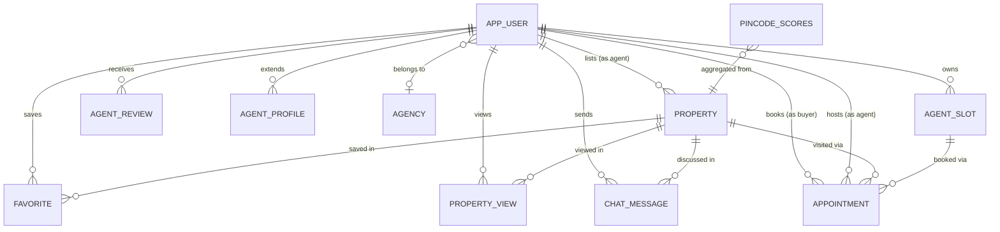

# 🗄️ Urban Nest — Enterprise Database Design (v2.0)

> **Standard:** PostgreSQL 15+ | **ORM:** Spring Data JPA (Hibernate) | **Migration Tool:** Custom SQL versioning

---

## Architecture Overview



---

## Naming Conventions (MNC Standard)

| Element | Convention | Example |
|---------|------------|----------|
| Tables | `snake_case`, singular noun | `property`, `app_user` |
| Columns | `snake_case` | `agent_id`, `listed_date` |
| Primary Keys | `id` (BIGSERIAL) | `id` |
| Foreign Keys | `{referenced_table}_id` | `agent_id`, `property_id` |
| Boolean columns | `is_` or plain adjective | `active`, `sold`, `featured` |
| Timestamp columns | `_at` suffix | `created_at`, `listed_date` |
| Indexes | `idx_{table}_{columns}` | `idx_property_city_pincode_active` |
| Unique indexes | `idx_{table}_{columns}_unique` | `idx_favorite_user_property_unique` |
| Check constraints | `chk_{table}_{column}` | `chk_property_price_positive` |
| Triggers | `trg_{table}_{action}` | `trg_property_updated_at` |
| Views | `vw_{description}` | `vw_active_properties` |
| Functions | `fn_{description}` | `fn_set_updated_at` |

---

## Table Catalogue

### `app_user` — Core User Accounts

| Column | Type | Constraints | Description |
|--------|------|-------------|-------------|
| `id` | BIGSERIAL | PK | Auto-increment user ID |
| `name` | VARCHAR | NOT NULL | Full display name |
| `email` | VARCHAR | NOT NULL, UNIQUE | Login email |
| `password` | VARCHAR | | BCrypt hashed. NULL for Google OAuth users |
| `role` | VARCHAR | CHECK IN (BUYER/AGENT/ADMIN) | User access level |
| `phone` | VARCHAR | | Contact number |
| `profile_image` | TEXT | | Cloudinary URL |
| `google_id` | VARCHAR | | Google OAuth sub-ID |
| `email_verified` | BOOLEAN | DEFAULT false | OTP verification status |
| `agency_id` | BIGINT | FK → agency | Agent's associated agency |
| `created_at` | TIMESTAMPTZ | DEFAULT NOW() | Account creation time |
| `updated_at` | TIMESTAMPTZ | AUTO | Last profile update |
| `last_login_at` | TIMESTAMPTZ | | Most recent login |
| `deleted_at` | TIMESTAMPTZ | | Soft delete timestamp |

**Indexes:** `idx_app_user_email`, `idx_app_user_role`

---

### `property` — Property Listings

| Column | Type | Constraints | Description |
|--------|------|-------------|-------------|
| `id` | BIGSERIAL | PK | Auto-increment listing ID |
| `title` | VARCHAR | NOT NULL | Listing headline |
| `description` | TEXT | | Full property description |
| `type` | VARCHAR | CHECK | Apartment / Villa / Independent House / Projects |
| `purpose` | VARCHAR | CHECK IN (Sale/Rent) | Listing intent |
| `price` | DOUBLE | CHECK > 0 | Total price (₹) or monthly rent |
| `area` | DOUBLE | CHECK > 0 | Floor area in sq.ft |
| `bhk` | INTEGER | CHECK 1-10 | Bedroom count |
| `bathrooms` | INTEGER | | Bathroom count |
| `city` | VARCHAR | NOT NULL | City name (Ahmedabad/Mumbai/Bangalore) |
| `pin_code` | VARCHAR | NOT NULL | 6-digit India postal code |
| `latitude` | DOUBLE | CHECK range | GPS latitude (-90 to 90) |
| `longitude` | DOUBLE | CHECK range | GPS longitude (-180 to 180) |
| `agent_id` | BIGINT | FK → app_user NOT NULL | Listing agent |
| `active` | BOOLEAN | DEFAULT true | Whether listing is published |
| `sold` | BOOLEAN | DEFAULT false | Whether sold/rented |
| `featured` | BOOLEAN | DEFAULT false | Admin/agent featured flag |
| `views` | INTEGER | DEFAULT 0 | Total unique view count |
| `favorites` | INTEGER | DEFAULT 0 | Denormalized favorite count (cache) |
| `inquiries` | INTEGER | DEFAULT 0 | Contact/inquiry event count |
| `listed_date` | TIMESTAMPTZ | @PrePersist | Auto-set on creation |
| `sold_at` | TIMESTAMPTZ | | When marked as sold |
| `rera_id` | VARCHAR | | RERA registration number |
| `property_images` | TEXT | | JSON array of Cloudinary URLs |
| `amenities` | TEXT | | JSON array of amenity strings |
| `created_at` | TIMESTAMPTZ | DEFAULT NOW() | Row creation time |
| `updated_at` | TIMESTAMPTZ | AUTO | Last modification time |
| `deleted_at` | TIMESTAMPTZ | | Soft delete timestamp |
| `version` | INTEGER | DEFAULT 1 | Optimistic lock version |

**Indexes (7 covering indexes for heatmap + listing queries):**
- `idx_property_city_pincode_active` — Heatmap grouping
- `idx_property_city_purpose_active` — Purpose filter
- `idx_property_city_type_active` — Type filter
- `idx_property_heatmap_full` — Combined filter
- `idx_property_featured` — Featured listings
- `idx_property_views_desc` — Trending
- `idx_property_title_fts` — Full-text search

---

### `pincode_scores` — Heatmap Analytics

| Column | Type | Description |
|--------|------|-------------|
| `city` | VARCHAR | City name |
| `pincode` | VARCHAR | 6-digit pincode |
| `price_score` | DOUBLE | Log-normalized median price index (0-100) |
| `inventory_score` | DOUBLE | Relative listing saturation (0-100) |
| `buyer_opportunity_score` | DOUBLE | Composite buyer advantage index (0-100) |
| `demand_score` | DOUBLE | Percentile-ranked engagement per listing (0-100) |
| `liquidity_score` | DOUBLE | Velocity score from days-on-market (0-100) |
| `market_activity_score` | DOUBLE | Demand+Liquidity composite (0-100) |
| `active_listings` | INTEGER | Number of active listings in this pincode |
| `median_price_per_sqft` | DOUBLE | Median price/sqft (raw, for tooltip display) |
| `avg_days_on_market` | DOUBLE | Average age of active listings (days) |
| `total_views` | INTEGER | Total view count across pincode |
| `last_computed` | TIMESTAMPTZ | When scores were last refreshed |

**Unique Constraint:** `(city, pincode)` — one row per area  
**Minimum threshold:** 5 active listings required for score computation

---

### `favorite` — User Watchlist

| Column | Type | Constraints | Description |
|--------|------|-------------|-------------|
| `id` | BIGSERIAL | PK | Auto-increment favorite ID |
| `user_id` | BIGINT | FK → app_user NOT NULL | The user who favorited |
| `property_id` | BIGINT | FK → property NOT NULL | The favorited property |
| `created_at` | TIMESTAMPTZ | DEFAULT NOW() | When the favorite was added |

**Unique Constraint:** `(user_id, property_id)` — no duplicate favorites  
**Indexes:** `idx_favorite_user_id`, `idx_favorite_property_id`, `idx_favorite_user_property_unique`

---

### `property_view` — View Tracking

| Column | Type | Constraints | Description |
|--------|------|-------------|-------------|
| `id` | BIGSERIAL | PK | Auto-increment view ID |
| `user_id` | BIGINT | FK → app_user | Viewing user |
| `property_id` | BIGINT | FK → property | Viewed property |
| `viewed_at` | TIMESTAMPTZ | DEFAULT NOW() | View timestamp |

**Unique Constraint:** `(user_id, property_id)` — one record per user-property pair  
**Indexes:** `idx_property_view_user_property_unique`, `idx_property_view_user_viewed_at`

---

### `appointment` — Property Visit Appointments

| Column | Type | Constraints | Description |
|--------|------|-------------|-------------|
| `id` | BIGSERIAL | PK | Auto-increment appointment ID |
| `buyer_id` | BIGINT | FK → app_user NOT NULL | Buyer requesting visit |
| `agent_id` | BIGINT | FK → app_user NOT NULL | Agent hosting visit |
| `property_id` | BIGINT | FK → property NOT NULL | Property to be visited |
| `slot_id` | BIGINT | FK → agent_slot | Booked availability slot |
| `status` | VARCHAR | | awaiting_buyer / confirmed / cancelled / completed |
| `confirmation_deadline` | TIMESTAMPTZ | | Buyer must confirm by this time |
| `created_at` | TIMESTAMPTZ | DEFAULT NOW() | When appointment was requested |
| `updated_at` | TIMESTAMPTZ | AUTO | Last status change |

**Indexes:** `idx_appointment_buyer_id`, `idx_appointment_agent_id`, `idx_appointment_status_deadline`

---

### `chat_message` — Buyer ↔ Agent Messaging

| Column | Type | Constraints | Description |
|--------|------|-------------|-------------|
| `id` | BIGSERIAL | PK | Auto-increment message ID |
| `sender_id` | BIGINT | FK → app_user NOT NULL | Message author |
| `receiver_id` | BIGINT | FK → app_user NOT NULL | Message recipient |
| `property_id` | BIGINT | FK → property | Property context of the chat |
| `content` | TEXT | NOT NULL | Message body |
| `sent_at` | TIMESTAMPTZ | DEFAULT NOW() | Timestamp sent |
| `updated_at` | TIMESTAMPTZ | | Edit timestamp (nullable) |

**Indexes:** `idx_chat_message_property_id`, `idx_chat_message_sender_receiver`

---

### `agent_review` — Agent Ratings

| Column | Type | Constraints | Description |
|--------|------|-------------|-------------|
| `id` | BIGSERIAL | PK | Auto-increment review ID |
| `agent_id` | BIGINT | FK → app_user NOT NULL | Reviewed agent |
| `reviewer_id` | BIGINT | FK → app_user NOT NULL | Buyer who reviewed |
| `rating` | INTEGER | CHECK 1-5 | Star rating (1–5) |
| `comment` | TEXT | | Review text |
| `created_at` | TIMESTAMPTZ | DEFAULT NOW() | Review submission time |

**Indexes:** `idx_agent_review_agent_id`, `idx_agent_review_reviewer_agent`

---

### `agency` — Real Estate Agencies

| Column | Type | Constraints | Description |
|--------|------|-------------|-------------|
| `id` | BIGSERIAL | PK | Auto-increment agency ID |
| `name` | VARCHAR | NOT NULL, UNIQUE | Agency display name |
| `agency_code` | VARCHAR | UNIQUE | Short agency code (e.g. SKY-01) |
| `license_number` | VARCHAR | | Real estate license number |
| `logo` | TEXT | | Base64 or Cloudinary URL of agency logo |
| `status` | VARCHAR | | APPROVED / PENDING / SUSPENDED |
| `created_at` | TIMESTAMPTZ | DEFAULT NOW() | Agency registration time |

---

### `agent_slot` — Agent Availability Slots

| Column | Type | Constraints | Description |
|--------|------|-------------|-------------|
| `id` | BIGSERIAL | PK | Auto-increment slot ID |
| `agent_id` | BIGINT | FK → app_user NOT NULL | Owning agent |
| `slot_time` | TIMESTAMPTZ | NOT NULL | Date and time of availability |
| `booked` | BOOLEAN | DEFAULT false | Whether slot is already booked |

**Indexes:** `idx_agent_slot_agent_id`, `idx_agent_slot_available`

---

### `db_migrations` — Schema Version Tracking

| Column | Type | Description |
|--------|------|-------------|
| `id` | SERIAL | PK |
| `version` | VARCHAR(20) | Unique version string (e.g. 2.0.0) |
| `description` | TEXT | Human-readable description of the migration |
| `applied_at` | TIMESTAMPTZ | Timestamp when migration was applied |
| `applied_by` | VARCHAR(100) | Database user who applied the migration |
| `execution_ms` | INTEGER | Time taken to execute (ms) |
| `checksum` | VARCHAR(64) | SHA-256 checksum of the migration file |

---

### `analytics_jobs` — Async Heatmap Job Queue

| Column | Type | Description |
|--------|------|-------------|
| `id` | SERIAL | PK |
| `job_type` | VARCHAR(50) | Job category (e.g. HEATMAP_REFRESH) |
| `city` | VARCHAR(100) | Target city (NULL = all cities) |
| `status` | VARCHAR(20) | PENDING / RUNNING / DONE / FAILED |
| `requested_at` | TIMESTAMPTZ | When the job was enqueued |
| `started_at` | TIMESTAMPTZ | When processing began |
| `completed_at` | TIMESTAMPTZ | When processing finished |
| `error_message` | TEXT | Failure reason (if FAILED) |
| `triggered_by` | VARCHAR(100) | User or system that triggered the job |

---

## Index Strategy

### Heatmap Query Coverage

The heatmap's most common query pattern is:
```sql
SELECT pin_code, COUNT(*), AVG(price/area), SUM(views), SUM(favorites), SUM(inquiries)
FROM property
WHERE LOWER(city) = LOWER(:city)
  AND LOWER(purpose) LIKE '%:purpose%'
  AND LOWER(type) = LOWER(:type)
  AND active = true AND sold = false
GROUP BY pin_code;
```

This is covered by `idx_property_heatmap_full (city, purpose, type, pin_code) WHERE active=true AND sold=false`.

### Estimated Query Performance

| Query | Before | After |
|-------|--------|-------|
| Heatmap city fetch | Seq scan (~80ms for 1000 rows) | Index scan (~2ms) |
| Featured properties | Seq scan | Partial index (~1ms) |
| Recently viewed | Seq scan | Composite index (~3ms) |
| Agent properties | Seq scan | FK index (~2ms) |
| Property search | Seq scan | GIN FTS (~5ms) |

### Index Design Principles

1. **Partial indexes for boolean filters** — `WHERE active = true AND sold = false` filters dramatically reduce index size and improve I/O efficiency.
2. **Composite indexes ordered by selectivity** — city (high selectivity) → purpose → type → pin_code.
3. **GIN for full-text search** — `pg_trgm` extension enables fast trigram-based LIKE searches on title/location.
4. **Unique indexes as constraints** — `idx_favorite_user_property_unique` serves dual purpose: data integrity and lookup performance.
5. **Covering indexes** — Heatmap indexes include `pin_code` in the index leaf to avoid heap fetches on GROUP BY.

---

## View Catalogue

| View | Purpose | Used By |
|------|---------|--------|
| `vw_active_properties` | All unsold, non-deleted listings with agent info | Property listing APIs |
| `vw_city_stats` | Real-time city property counts — replaces hardcoded Home page numbers | `GET /api/analytics/city-stats` |
| `vw_heatmap_summary` | Live per-pincode aggregates (bypasses pre-computed scores) | Debug / admin tools |
| `vw_agent_performance` | Agent KPI dashboard (listings, sold, rating, engagement) | Admin dashboard |
| `vw_user_recently_viewed` | Recently viewed active properties per user | Home page recently viewed |

---

## Audit Infrastructure

### Auto-Timestamp Trigger

The `fn_set_updated_at()` trigger function automatically maintains `updated_at` on every `UPDATE` operation:

```sql
CREATE OR REPLACE FUNCTION fn_set_updated_at()
RETURNS TRIGGER AS $$
BEGIN
    NEW.updated_at = NOW();
    RETURN NEW;
END;
$$ LANGUAGE plpgsql;
```

Applied to: `property`, `app_user`, `appointment`

### Soft Delete Pattern

Tables with `deleted_at IS NULL` support logical deletion without data loss:

```sql
-- Soft delete a property
UPDATE property SET deleted_at = NOW() WHERE id = :id;

-- All active queries filter: AND deleted_at IS NULL
```

### Optimistic Locking

The `version` column on `property` supports concurrent edit safety in JPA:

```java
@Version
private Integer version;
```

---

## Migration Versioning

All schema changes are tracked in `db_migrations` table:

```sql
SELECT version, description, applied_at, applied_by
FROM db_migrations
ORDER BY applied_at;
```

**Rule:** Never modify applied migrations. Always create new migration files with incrementing versions (2.0.1, 2.0.2, etc.).

### Migration File Naming

```
backend/
  schema_mnc_upgrade.sql        ← v2.0.0 (this file)
  migrations/
    v2_0_1_add_rera_index.sql
    v2_0_2_property_partitioning.sql
```

---

## Performance Checklist (MNC Standard)

- [x] All foreign keys have backing indexes
- [x] Partial indexes used for boolean filters (active, sold, featured)
- [x] GIN index for full-text search
- [x] Covering indexes for heatmap queries (avoid heap fetches)
- [x] Composite indexes ordered by selectivity (most selective column first)
- [x] Audit columns (created_at, updated_at) on all core tables
- [x] Soft delete pattern (deleted_at) — no data loss
- [x] Optimistic locking (version column) on property
- [x] Check constraints for all enum-like columns
- [x] Database views for repeated complex queries
- [x] Migration tracking table
- [ ] Table partitioning (future: partition property by city when >1M rows)
- [ ] Read replicas (future: route heatmap reads to replica)
- [ ] Connection pooling configuration (PgBouncer recommended)

---

## PostgreSQL Configuration Recommendations

For production deployments serving Urban Nest at scale:

```ini
# postgresql.conf — recommended tuning for this workload

# Memory
shared_buffers = 256MB          # 25% of RAM for dedicated DB servers
effective_cache_size = 768MB    # 75% of total RAM
work_mem = 16MB                 # Per-sort/hash operation
maintenance_work_mem = 128MB    # VACUUM, CREATE INDEX

# Planner
random_page_cost = 1.1          # SSD storage — prefer index scans
effective_io_concurrency = 200  # SSDs handle concurrent I/O well

# WAL / Durability
wal_buffers = 16MB
checkpoint_completion_target = 0.9

# Logging (for slow query detection)
log_min_duration_statement = 500  # Log queries > 500ms
log_checkpoints = on
```

> [!TIP]
> Run `EXPLAIN (ANALYZE, BUFFERS)` on all heatmap queries after applying this migration to verify index usage. Look for `Index Scan` or `Bitmap Index Scan` — never `Seq Scan` on the `property` table.

> [!IMPORTANT]
> The `pg_trgm` and `btree_gin` extensions require PostgreSQL superuser privileges to install. Run the migration with a superuser account the first time, then revoke superuser from the application DB user.

> [!WARNING]
> The `ADD COLUMN IF NOT EXISTS` statements for `created_at NOT NULL DEFAULT NOW()` will backfill `NOW()` for all existing rows. On a table with millions of rows, this is a blocking DDL operation. Use `pg_repack` or perform the migration during a maintenance window.
